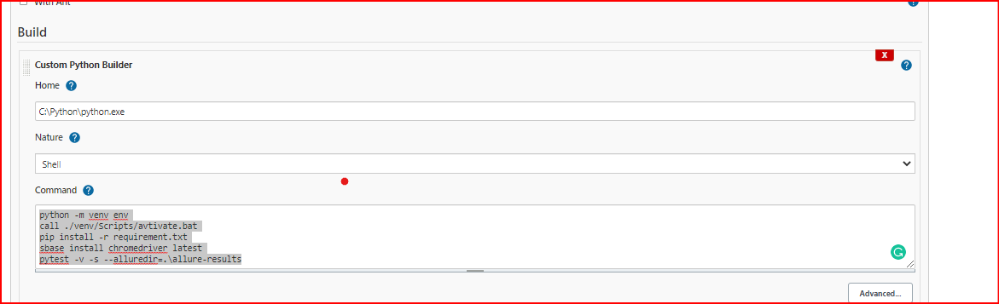

Pytest Selenium
This sample project would allow you to understand basic pytest run along with Allure reporting

Please make sure you have Python, Java installed on your machine beforehand

How to install pytest
pip install pytest

How to install selenium
pip install selenium or python -m pip install selenium

MS Excel support 
openpyxl

######## Folder Structure ############

    **Project Name** 
      |
      pageObjects(Package)
      |
      testCases(Package)
      |
      utilities(Package)
      | 
      TestData(Folder)
      |
      Configuration(Folder)
      |
      Logs(Folder)
      |
      Screenshots(Folder)
      |
      Reports(Folder)
      |
      Run.bat

####Reporting ###########

How to install allure
Download allure commandline from: https://mvnrepository.com/artifact/io.qameta.allure/allure-commandline/2.8.1
Unzip the directory and put the path of bin to PATH in environment variables
pip install allure-pytest or pip install pytest-allure-adaptor
 
**OR** 

<<<<<<< HEAD
**How to install pytest html**
pip install pytest-html
pytest -v -s --html=Reports\html-results.html

#####################################

**freeze requirement**
 pip freeze > requirements.txt

**How to configure jenkins**
=======
How to configure jenkins
>>>>>>> parent of cb4d021... add
Manage Jenkins -> Manage Plugins -> Python and Allure Also add Allure comma
cndline path in Global Tools Configuration

**How to setup PyCharm**
Install plugins in Pycharm explicitly for pytest, selenium and allure

How to run the code via cmd
pytest -v -s --alluredir=path to your report folder <test_filename.py>
<<<<<<< HEAD

jenkins 
python -m venv env
call ./venv/Scripts/activate.bat
pip install -r requirements.txt
sbase install chromedriver latest
pytest -v -s  -n=2 --browser chrome --alluredir=Reports\allure-results

=======
>>>>>>> parent of cb4d021... add
